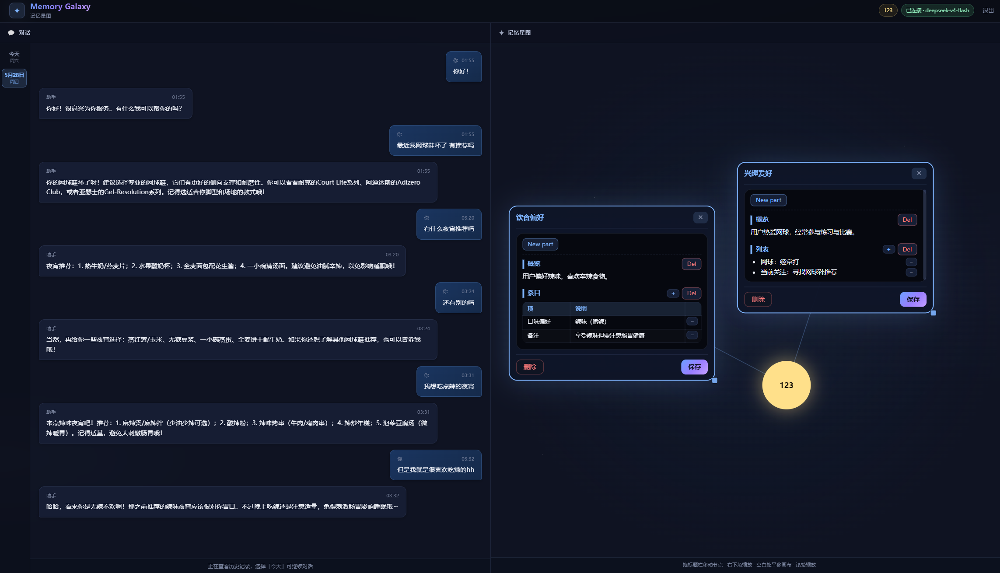

# Memory Galaxy · 记忆星图

**把 Agent 的长期记忆做成「看得见、改得了、用得准」的个人知识星图。**

## 界面预览



*左：按日期切换的对话与流式 Thinking；右：记忆星图，支持多模块同时展开编辑。*

---

## 这是什么

Memory Galaxy 是一个带**可视化记忆**的对话产品：左侧像普通聊天一样交流，右侧用**星图**展示你的记忆模块（兴趣、饮食偏好、工作项目等）。AI 会围绕这些模块与你对话，并在往来中持续补全、修正记忆——而你始终能亲眼看到它「记住了什么」、并在需要时亲手改。

适合个人知识助手、长期陪伴型 Bot，以及任何希望**记忆透明、可控、可长期积累**的 Agent 场景。

## 解决什么问题

长期记忆几乎是所有「会记住你」的 Agent 的共同难题，业内常见痛点包括：

| 痛点 | 用户/业务侧的感受 |
|------|-------------------|
| **记忆不可见** | 模型「好像记得」，但用户说不清它到底记住了什么，也难以核对是否记错、记混 |
| **记忆不可改** | 一旦发现偏差，只能反复口头纠正，或等下次对话碰运气覆盖，缺少一处「我的档案」可以直改 |
| **记忆越堆越乱** | 兴趣、工作、习惯、临时待办混在一起，没有主题边界，越用越像黑盒 |
| **纠错成本高** | 记错一句可能反复影响后续回复；没有结构化入口，很难精准删改某一条 |
| **信任感不足** | 面向 C 端或长期使用时，用户需要可审计、可理解的记忆，而不只是「系统内部有个向量库」 |

Memory Galaxy 的核心回应是：**把记忆从后台能力，变成用户能看、能改、能组织的产品界面**——用星图呈现主题模块，用 Wiki 式内容承载细节，让「长期记忆」第一次像一份属于自己的、可维护的档案，而不只是模型内部的隐状态。

## 产品优势

- **记忆可视化**：每个主题是一颗星图节点，整体结构一眼可读——有哪些维度、各记了多少，不再埋在 prompt 或数据库里。
- **记忆可编辑**：点开节点即可查看与修改，像维护个人 Wiki；纠正 AI 误记、补充它没问到的信息，都不必绕回聊天里反复解释。
- **主题化组织**：按模块拆分（兴趣、饮食、项目…），天然避免「所有东西搅在一团上下文」；聊什么，就看什么相关的记忆。
- **聊写一体**：对话在左、星图在右，说完就能在右侧核对或改记忆，减少「聊完不知道写没写进去」的不确定感。
- **可解释的路由过程**：助手会说明本轮为何关联（或不关联）某些记忆模块，降低「它凭什么这么回」的疑惑。
- **适合长期关系**：记忆以可读文档形式沉淀，越用越成体系，适合陪伴、顾问、个人助理等需要「越懂你越准」的产品形态。

---

## 功能概览

| 模块 | 说明 |
|------|------|
| 聊天 | 按日期保存到 `data/users/{用户}/chats/YYYY-MM-DD.json`；左侧日期栏切换查看，消息显示时间 |
| 流式对话 | `POST /api/chat/stream`：SSE 推送路由 Thinking + 回复增量 |
| 记忆模块 | 每模块一个 `modules/{英文slug}.html`，中文名在 `<article data-title="…">` |
| 模块路由 | 近 N 轮 + 当前输入 → LLM 返回 `related_modules` + `route_thought` |
| 对话生成 | 相关模块内容 + 上下文 → `reply` + `module_updates` |
| 星图 UI | 用户名为中心，模块为节点；可多节点同时展开；拖动、右下角缩放、布局 localStorage 缓存 |
| 响应式布局 | PC 左聊右图；手机/窄屏上星图、下聊天 |
| Wiki 编辑器 | 节点内 `New part` 增分节、`+` 增条目，分节名与正文可点击编辑 |
| 多用户 | 用户名登录（Session），聊天与记忆按用户目录隔离 |

---

## 快速开始

```bash
cd memory_galaxy
cp config.yaml.example config.yaml
# 编辑 config.yaml（api_key、session_secret、端口、模型等）

chmod +x run.sh
./run.sh
```

浏览器打开 `http://127.0.0.1:<server.port>`（端口见 `config.yaml` → `server.port`，默认示例为 `8765`）。

首次进入输入用户名（2–24 字）即可使用。

---

## 配置

所有配置均在项目根目录 **`config.yaml`**，修改后需重启服务：

| 节点 | 说明 |
|------|------|
| `server` | `host` / `port` / `reload` |
| `llm` | `api_base` / `api_key` / `model` / `timeout` / `json_mode` / `stream` / `temperature.*` |
| `chat` | `recent_turns_limit`（注入 LLM 的最近消息条数） |
| `auth` | `session_secret` / 用户名长度限制 |
| `data` | 本地数据目录 |
| `prompts` | Prompt 模板目录 |

---

## 目录结构

```
memory_galaxy/
├── image.png                # README 界面预览图
├── config.yaml.example      # 配置模板（复制为 config.yaml，勿提交密钥）
├── prompts/                 # Prompt 模板（每项一个 .md）
│   ├── module_router_system.md
│   ├── module_router_user.md
│   ├── chat_memory_system.md
│   ├── chat_memory_user.md
│   └── module_content_format.md   # 模块 Wiki HTML 规范
├── backend/
│   ├── main.py              # FastAPI 入口、SSE 流式 API
│   ├── config.py            # 加载 config.yaml
│   ├── run.py               # 启动脚本
│   └── services/
│       ├── storage.py       # 聊天 & 模块文件读写
│       ├── module_html.py   # Wiki HTML 校验
│       ├── module_id.py     # 英文 slug / data-title
│       ├── prompts.py       # 读取 / 渲染 prompt
│       ├── json_util.py     # LLM JSON 解析 & 流式字段提取
│       └── llm.py           # 路由 + 对话 + SSE 流水线
├── frontend/
│   ├── js/
│   │   ├── app.js           # 登录、聊天主流程
│   │   ├── api.js           # REST + SSE 客户端
│   │   ├── chat.js          # 聊天气泡、Thinking UI
│   │   ├── starmap.js       # D3 星图、展开/拖动/缩放/布局缓存
│   │   └── wiki-editor.js   # 节点内 Wiki 编辑增强
│   └── css/style.css
├── data/
│   └── users/
│       └── {用户名}/
│           ├── profile.json
│           ├── chats/
│           └── modules/
└── run.sh
```

---

## 实现要点

### 对话流水线（两步 LLM + 流式）

1. **模块路由**：根据已有模块列表、近几轮对话与当前输入，判断应注入哪些模块；输出含 CoT `thinking` 与面向用户的 `route_thought`。
2. **对话与记忆更新**：仅携带相关模块的 Wiki HTML，生成自然语言回复，并给出需 create/update/delete 的 `module_updates`。
3. **SSE 推送**：前端走 `/api/chat/stream`，事件类型包括 `route_thought_delta`、`route_done`、`reply_delta`、`chat_done`；助手单条气泡内为「Thinking（可折叠）+ 回复正文」。

### 记忆存储

- 聊天：按日 JSON 数组，`role` + `content`。
- 模块：Wiki 结构 HTML，磁盘文件名仅英文 slug；LLM 返回的 HTML 经 `validate_wiki_html` 校验，不合规则丢弃并打错误日志。
- 路由上下文**不带**全量历史，仅 `recent_turns_limit` 条 + 当前输入（均为**当日**聊天文件）。
- 界面可浏览历史日期的聊天记录，但**仅「今天」**可发送新消息。

### 星图交互

- **foreignObject** 在节点内展开圆角编辑框；支持**多个模块同时展开**；点击画布空白不会收起。
- 标题栏拖动节点，右下角缩放（左上角锚定）；用节点内 **×** 收起单个模块。
- 节点坐标、展开尺寸、画布 zoom 写入 `localStorage`（键：`memory_galaxy:layout:{用户名}`）。

---

## LLM 协议（JSON）

**步骤 1 · 模块路由**

```json
{
  "thinking": {
    "user_intent": "…",
    "module_scan": "…",
    "relevance": "…",
    "conclusion": "…"
  },
  "related_modules": ["hobbies"],
  "reason": "一句话摘要",
  "route_thought": "依据哪些线索关联到哪些模块（供 UI Thinking 展示）"
}
```

**步骤 2 · 对话与记忆更新**

```json
{
  "thinking": {
    "facts": "…",
    "memory_decision": "…",
    "module_plan": "…",
    "reply_strategy": "…"
  },
  "reply": "assistant 回复文本",
  "module_updates": [
    {
      "module_id": "hobbies",
      "action": "create",
      "content_html": "<article class=\"wiki-doc\" data-title=\"兴趣爱好\">…</article>"
    }
  ]
}
```

`action`：`create` | `update` | `delete`。`content_html` 须符合 `prompts/module_content_format.md`。

服务端对 `thinking` 打 info 日志；界面默认折叠展示路由 Thinking，完整 CoT 可展开查看。

---

## 登录与数据隔离

打开页面输入用户名即可（无密码，Session Cookie）。点击「退出」可切换用户。

数据示例：`data/users/123/chats/2026-05-28.json`

---

## API 摘要

| 方法 | 路径 | 说明 |
|------|------|------|
| POST | `/api/auth/login` | 登录 `{ "username": "…" }` |
| POST | `/api/auth/logout` | 退出 |
| GET | `/api/auth/me` | 当前用户 |
| GET | `/api/chats` | 已有聊天日期列表 |
| GET | `/api/chats/today` | 今日聊天记录 |
| GET | `/api/chats/{day}` | 指定日期聊天记录 |
| **POST** | **`/api/chat/stream`** | **流式聊天（推荐，SSE）** |
| POST | `/api/chat/route` | 仅路由（分步调试） |
| POST | `/api/chat/complete` | 仅对话（分步调试） |
| POST | `/api/chat` | 一次性非流式（兼容） |
| GET | `/api/modules` | 模块列表 |
| GET/PUT/DELETE | `/api/modules/{id}` | 模块读写删 |

---

## 后续可扩展（未实现）

- 记忆更新的人工确认 / 撤销
- 对话阶段 Thinking 也在 UI 展示（目前仅路由 Thinking）
- 模块间关联边（子模块、时间线）
- 星图布局同步到服务端（当前仅浏览器 localStorage）
